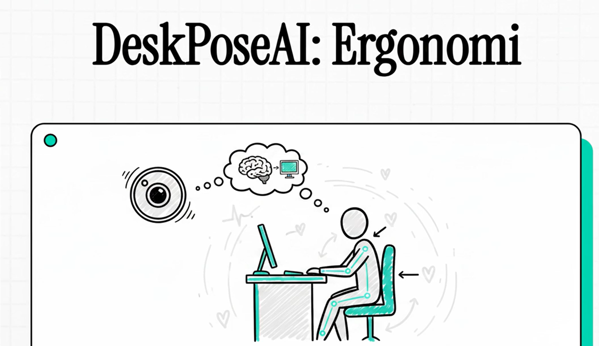

# 🖥️ DeskPoseAI

**Gerçek Zamanlı Masabaşı Ergonomi İzleme**  
Ofis çalışanları için kamera tabanlı ergonomi analizi. Tek bir dizüstü bilgisayar web kamerası ile çalışır — ek donanım gerekmez.


[](https://deskposeai.streamlit.app)

---

## Özellikler

### Tanıtım Videosu 
<p align="left">
  <a href="https://github.com/Ugeyik83/DeskPoseAI/issues/1">
    
  </a>
</p>

### Duruş Analizi
- **FHP Risk Skoru** — Baş Öne Eğilme riski, 0–100 (göz-omuz / omuz genişliği oranı)
- **Kalibre Mod (CAL)** — Kişisel baseline kaydedilir, sapma skoru hesaplanır
- **Tahmini Mod (EST)** — Kalibrasyon olmadan mutlak referans değerleri
- **Baş Eğim Açısı (Roll)** — `arctan(Δy/Δx)` — yanal fleksiyon tespiti
- **Omuz Asimetrisi** — Sol/sağ omuz yükseklik farkı (trapezius gerilim göstergesi)

### Göz Sağlığı
- **EAR Göz Kırpma Hızı** — Göz Görünüm Oranı (Soukupová & Čech 2016)
  - Adaptif eşik: kalibrasyon EAR × 0.70
  - Normal: 15–20 kırpma/dk, ekran başında 3–7/dk'ya düşer
  - CVS (Bilgisayar Görme Sendromu) erken uyarısı
- **PERCLOS** — Göz kapalı kalma yüzdesi, yorgunluk göstergesi (NHTSA P70 standardı)
  - < %8 → Normal uyanıklık
  - %8–15 → Hafif yorgunluk
  - > %15 → Ciddi yorgunluk
- **Ekran Mesafesi** — Iris çapı tabanlı (Bekerman 2014, iris = 11.7 mm sabit)
  - Kalibrasyonlu: baseline iris pikseli × mesafe oranı
  - Kalibrasyonsuz: pinhole buluşu (~60° GGA)
  - ISO 9241 standardı: 50–100 cm ideal

### Yaşamsal Bulgular
- **Kalp Atış Hızı (rPPG)** — CHROM algoritması (De Haan & Jeanne 2013)
  - Alın + sol yanak + sağ yanak ROI
  - Welch PSD frekans analizi
  - Fizyolojik öncelik bandı: 60–150 BPM
  - Adaptif buffer, dinamik hareket eşiği
- **HRV — RMSSD** — rPPG sinyalinden kalp hızı değişkenliği (Deneysel)
  - CHROM + Ten rengi kalibrasyonu + Elgendi peak detection
  - Temporal averaging (4 pencere medyanı)
  - %20 ardışık fark filtresi
- **Solunum Hızı** — rPPG düşük bant filtresi (0.1–0.6 Hz)
  - Kümülatif nefes sayacı
  - Normal: 12–20 nefes/dk

### Ergonomi Takibi
- **Oturma Süresi** — 30/60/90 dk kademeli uyarı sistemi
- **20-20-20 Hatırlatıcısı** — Her 20 dk'da bir 6 metre uzağa bak
- **Kalibrasyon Kalite Filtresi** — Eğim/asimetri bozuksa örnek reddedilir
- **Görünürlük Kapısı** — Güvenilmez kareler iptal edilir

---

## Algoritmalar

### FHP (Baş Öne Eğilme)

```
S1 = (omuz_y - göz_y)  / omuz_genişliği
S2 = (omuz_y - burun_y) / omuz_genişliği

CAL modu: delta_göz × 40 + delta_burun × 60 → sapma skoru
EST modu: (1.5 - S1) × 50 + (1.2 - S2) × 50 → bileşik skor
```

### EAR (Göz Görünüm Oranı)

```
EAR = (|p2-p6| + |p3-p5|) / (2 × |p1-p4|)
Kırpma: EAR < eşik, ≥2 ardışık kare
Adaptif eşik: kalibrasyon_EAR × 0.70 (sınır: 0.15–0.25)
```

### PERCLOS

```
PERCLOS = (EAR < eşik olan kare sayısı) / (toplam kare sayısı) × 100
P70 standardı: tam açık EAR'ın %70'i altı = kapalı
```

### Ekran Mesafesi

```
Kalibrasyonlu:  mesafe = 60 cm × (baseline_iris_px / mevcut_iris_px)
Kalibrasyonsuz: mesafe = (11.7 mm / 1000) × odak_px / iris_px × 100
```

### rPPG CHROM

```
1. Alın + yanak ROI → RGB ortalama (hareket algılanırsa atla)
2. Normalleştir: Rn = R/ort(R), Gn, Bn
3. Krominans: Xs = 3Rn - 2Gn, Ys = 1.5Rn + Gn - 1.5Bn
4. S = Xs - (std_Xs / std_Ys) × Ys → trend giderme
5. Welch PSD (nperseg=128, noverlap=64)
6. Öncelik bandı: 60–150 BPM
7. SNR = tepe / medyan(gürültü) > 1.0
8. Gauss ağırlıklı tepe → BPM
9. Medyan yumuşatma (son 3 değer)
```

### Solunum Hızı

```
1. CHROM S sinyali → CubicSpline interpolasyon (10 Hz)
2. Butterworth bandpass: 0.1–0.6 Hz
3. find_peaks (min mesafe: 1.5 sn, prominence: 0.5)
4. Tepe aralıkları → nefes/dk
```

---

## Sinyal Filtreleme

**One-Euro Filtresi** — tüm sinyallere uygulanır:
- Düşük hızda yüksek yumuşatma, yüksek hızda düşük yumuşatma
- Gecikmeyi minimize eder

| Sinyal | min_cutoff | beta |
|--------|-----------|------|
| FHP (S1, S2) | 1.0 / 0.5 | 0.007 / 0.003 |
| Eğim | 1.0 | 0.007 |
| Omuz asim. | 0.5 | 0.003 |
| EAR | 2.0 | 0.01 |
| Ekran mesafesi | 0.5 | 0.003 |
| Kalp atış hızı | 0.15 | 0.05 |

---

## Risk Eşikleri

| Metrik | 🟢 İyi | 🟡 Uyarı | 🔴 Kritik |
|--------|--------|----------|----------|
| FHP Skoru | < 25 | 25–50 | > 50 |
| Baş eğimi | < 5° | 5–10° | > 10° |
| Omuz asim. | < %3 | %3–6 | > %6 |
| Göz kırpma | ≥ 10/dk | 5–10/dk | < 5/dk |
| PERCLOS | < %8 | %8–15 | > %15 |
| Ekran mesafesi | 50–100 cm | 40–50 cm | < 40 cm |
| Oturma süresi | < 30 dk | 30–60 dk | > 60 dk |
| Kalp atış hızı | 60–100 BPM | 50–60 / 100–120 | < 50 / > 120 |
| Solunum hızı | 12–20/dk | < 12 / 20–30/dk | > 30/dk |

---

## Kurulum

```bash
git clone https://github.com/Ugeyik83/DeskPoseAI.git
cd DeskPoseAI
pip install -r requirements.txt
streamlit run app.py
```

### Gereksinimler

```
streamlit>=1.35.0
opencv-python-headless>=4.9.0
mediapipe==0.10.21
numpy>=1.26.0,<2.0
plyer>=2.1.0
streamlit-webrtc>=0.47.0
av>=12.0.0
scipy>=1.14.0,<2.0
```

---

## Kullanım

1. **START** — kamerayı etkinleştir
2. **Kalibre Et** — dik otur, 3 sn bekle → kişisel baseline kaydedilir
3. Metrik kartlarını izle
4. **CAL** rozeti → kalibre mod aktif
5. **EST** rozeti → tahmini mod (kalibrasyon önerilir)

### Kalibrasyon ipuçları
- Dik otur, omuzların seviyede olsun
- Doğrudan kameraya bak
- 3 saniye hareketsiz kal
- İyi aydınlatma → daha iyi rPPG doğruluğu

---

## Dosya Yapısı

```
DeskPoseAI/
├── app.py                  # Streamlit UI + WebRTC
├── requirements.txt
├── packages.txt
├── core/
│   ├── pose_analyzer.py    # Ana analiz motoru
│   ├── hrv_analyzer.py     # HRV — RMSSD modülü
│   ├── resp_analyzer.py    # Solunum hızı modülü
│   ├── alert_manager.py    # İşletim sistemi bildirimleri
│   └── session_logger.py   # CSV kayıt
└── logs/                   # Oturum kayıtları
```

---

## Sınırlamalar

| Kısıt | Açıklama |
|-------|----------|
| **Yalnızca ön kamera** | CVA ölçümü klinik değil, yaklaşımdır |
| **rPPG doğruluğu** | ±5–8 BPM, ışık ve harekete bağımlı |
| **HRV** | Deneysel — webcam + H.264 sıkıştırması güvenilirliği sınırlar |
| **Solunum hızı** | Deneysel — hareket artefaktına duyarlı |
| **Ekran mesafesi** | Kalibrasyonsuz ±10–15 cm hata |
| **Koyu giysi** | Omuz tespiti bozulur |
| **Yetersiz aydınlatma** | rPPG güvenilmez |

> FHP Risk Skoru klinik bir CVA ölçümü değildir. Tıbbi amaçla kullanılamaz.

---

## Yol Haritası

### Kısa Vadeli
- [x] **PERCLOS** — göz kapalı kalma yüzdesi, yorgunluk tespiti
- [x] **HRV — RMSSD** — rPPG tabanlı kalp hızı değişkenliği (deneysel)
- [x] **Solunum Hızı** — rPPG düşük bant filtresi
- [x] **20-20-20 Hatırlatıcısı** — göz yorgunluğu önleme
- [ ] **3D Baş Pozu (solvePnP)** — gerçek pitch/yaw/roll
- [ ] **Oturum PDF Raporu** — ergonomi özeti, trend grafikleri

### Orta Vadeli
- [ ] **Masaüstü Uygulaması** — CustomTkinter + `cv2.VideoCapture`
- [ ] **PyInstaller Paketi** — Windows `.exe` / macOS `.app`
- [ ] **IPD Füzyonu** — ekran mesafesi hatası ±3 cm
- [ ] **Çok Kullanıcılı Profiller** — kullanıcı başına ayrı baseline

### Uzun Vadeli
- [ ] **ML Tabanlı FHP** — Random Forest/LSTM duruş sınıflandırması
- [ ] **Hibrit rPPG** — CHROM + PhysNet sinyal iyileştirme
- [ ] **Ergonomi Skoru Trendleri** — günlük/haftalık istatistik panosu
- [ ] **İSG Entegrasyonu** — kurumsal çalışan sağlığı yönetim sistemi API
- [ ] **Egzoskeleton Tetikleyici** — kritik duruş → aktivasyon sinyali (araştırma)
- [ ] **HRV Masaüstü** — yüksek FPS kamera + kontrollü ortam

---

## Kaynaklar

| Algoritma | Kaynak |
|-----------|--------|
| EAR Göz Kırpma Tespiti | Soukupová & Čech, BMVC 2016 |
| CHROM rPPG | De Haan & Jeanne, IEEE TBME 2013 |
| Iris Çapı Sabiti | Bekerman ve ark., IOVS 2014 |
| CVA Klinik Eşiği | Griegel-Morris ve ark., PTJ 1992 |
| Ekran Mesafesi Standardı | ISO 9241-5 |
| One-Euro Filtresi | Casiez ve ark., CHI 2012 |
| PERCLOS Standardı | Wierwille & Ellsworth, NHTSA 1994 |
| Elgendi Peak Detection | Elgendi ve ark., PLoS ONE 2013 |

---

## Lisans

MIT Lisansı — akademik ve ticari kullanıma açık.

---
---

# 🖥️ DeskPoseAI

**Real-time Desk Ergonomics Monitoring**  
Camera-based ergonomics analysis for office workers. Works with a single laptop webcam — no extra hardware required.


[](https://deskposeai.streamlit.app)

---

## Features

### Posture Analysis
- **FHP Risk Score** — Forward Head Posture risk, 0–100 (eye-shoulder / shoulder-width ratio)
- **Calibrated Mode (CAL)** — Personal baseline recorded, deviation score calculated
- **Estimated Mode (EST)** — Absolute reference values without calibration
- **Head Tilt Angle (Roll)** — `arctan(Δy/Δx)` — lateral flexion detection
- **Shoulder Asymmetry** — Left/right shoulder height difference (trapezius tension indicator)

### Eye Health
- **EAR Blink Rate** — Eye Aspect Ratio (Soukupová & Čech 2016)
  - Adaptive threshold: calibration EAR × 0.70
  - Normal: 15–20 blinks/min, drops to 3–7/min at screen
  - CVS (Computer Vision Syndrome) early warning
- **PERCLOS** — Percentage of eye closure, fatigue indicator (NHTSA P70 standard)
  - < 8% → Normal alertness
  - 8–15% → Mild fatigue
  - > 15% → Severe fatigue
- **Screen Distance** — Iris diameter based (Bekerman 2014, iris = 11.7mm constant)
  - With calibration: baseline iris pixel × distance ratio
  - Without calibration: pinhole heuristic (~60° FOV)
  - ISO 9241 standard: 50–100 cm ideal

### Vital Signs
- **Heart Rate (rPPG)** — CHROM algorithm (De Haan & Jeanne 2013)
  - Forehead + left cheek + right cheek ROI
  - Welch PSD frequency analysis
  - Physiological priority band: 60–150 BPM
  - Adaptive buffer, dynamic motion threshold
- **HRV — RMSSD** — Heart rate variability from rPPG signal (Experimental)
  - CHROM + Skin tone calibration + Elgendi peak detection
  - Temporal averaging (4-window median)
  - 20% successive difference filter
- **Respiratory Rate** — rPPG low-band filter (0.1–0.6 Hz)
  - Cumulative breath counter
  - Normal: 12–20 breaths/min

### Ergonomics Tracking
- **Sitting Duration** — 30/60/90 min graduated alert system
- **20-20-20 Reminder** — Every 20 min, look 6 meters away for 20 seconds
- **Calibration Quality Filter** — Samples rejected if tilt/asymmetry is poor
- **Visibility Gating** — Unreliable frames discarded

---

## Algorithms

### FHP (Forward Head Posture)

```
S1 = (shoulder_y - eye_y)  / shoulder_width
S2 = (shoulder_y - nose_y) / shoulder_width

CAL mode: delta_eye × 40 + delta_nose × 60 → deviation score
EST mode: (1.5 - S1) × 50 + (1.2 - S2) × 50 → composite score
```

### EAR (Eye Aspect Ratio)

```
EAR = (|p2-p6| + |p3-p5|) / (2 × |p1-p4|)
Blink: EAR < threshold, ≥2 consecutive frames
Adaptive threshold: calibration_EAR × 0.70 (clamp: 0.15–0.25)
```

### PERCLOS

```
PERCLOS = (frames where EAR < threshold) / (total frames) × 100
P70 standard: below 70% of fully open EAR = closed
```

### Screen Distance

```
With calibration:    dist = 60cm × (baseline_iris_px / current_iris_px)
Without calibration: dist = (11.7mm / 1000) × focal_px / iris_px × 100
```

### rPPG CHROM

```
1. Forehead + cheek ROI → RGB mean (skip if motion detected)
2. Normalize: Rn = R/mean(R), Gn, Bn
3. Chrominance: Xs = 3Rn - 2Gn, Ys = 1.5Rn + Gn - 1.5Bn
4. S = Xs - (std_Xs / std_Ys) × Ys → detrend
5. Welch PSD (nperseg=128, noverlap=64)
6. Priority band: 60–150 BPM
7. SNR = peak / median(noise) > 1.0
8. Gaussian-weighted peak → BPM
9. Median smoothing (last 3 values)
```

### Respiratory Rate

```
1. CHROM S signal → CubicSpline interpolation (10 Hz)
2. Butterworth bandpass: 0.1–0.6 Hz
3. find_peaks (min distance: 1.5s, prominence: 0.5)
4. Peak intervals → breaths/min
```

---

## Signal Filtering

**One-Euro Filter** — applied to all signals:
- High smoothing at low speed, low smoothing at high speed
- Minimizes lag

| Signal | min_cutoff | beta |
|--------|-----------|------|
| FHP (S1, S2) | 1.0 / 0.5 | 0.007 / 0.003 |
| Tilt | 1.0 | 0.007 |
| Shoulder asym. | 0.5 | 0.003 |
| EAR | 2.0 | 0.01 |
| Screen distance | 0.5 | 0.003 |
| Heart rate | 0.15 | 0.05 |

---

## Risk Thresholds

| Metric | 🟢 Good | 🟡 Warning | 🔴 Critical |
|--------|---------|-----------|------------|
| FHP Score | < 25 | 25–50 | > 50 |
| Head tilt | < 5° | 5–10° | > 10° |
| Shoulder asym. | < 3% | 3–6% | > 6% |
| Blink rate | ≥ 10/min | 5–10/min | < 5/min |
| PERCLOS | < 8% | 8–15% | > 15% |
| Screen distance | 50–100 cm | 40–50 cm | < 40 cm |
| Sitting duration | < 30 min | 30–60 min | > 60 min |
| Heart rate | 60–100 BPM | 50–60 / 100–120 | < 50 / > 120 |
| Respiratory rate | 12–20/min | < 12 / 20–30/min | > 30/min |

---

## Installation

```bash
git clone https://github.com/Ugeyik83/DeskPoseAI.git
cd DeskPoseAI
pip install -r requirements.txt
streamlit run app.py
```

### Requirements

```
streamlit>=1.35.0
opencv-python-headless>=4.9.0
mediapipe==0.10.21
numpy>=1.26.0,<2.0
plyer>=2.1.0
streamlit-webrtc>=0.47.0
av>=12.0.0
scipy>=1.14.0,<2.0
```

---

## Usage

1. **START** — activate camera
2. **Calibrate** — sit upright, wait 3 sec → personal baseline saved
3. Monitor metric cards
4. **CAL** badge → calibrated mode active
5. **EST** badge → estimated mode (calibration recommended)

### Calibration tips
- Sit upright, shoulders level
- Look straight at the camera
- Stay still for 3 seconds
- Good lighting → better rPPG accuracy

---

## File Structure

```
DeskPoseAI/
├── app.py                  # Streamlit UI + WebRTC
├── requirements.txt
├── packages.txt
├── core/
│   ├── pose_analyzer.py    # Main analysis engine
│   ├── hrv_analyzer.py     # HRV — RMSSD module
│   ├── resp_analyzer.py    # Respiratory rate module
│   ├── alert_manager.py    # OS notifications
│   └── session_logger.py   # CSV logging
└── logs/                   # Session logs
```

---

## Limitations

| Constraint | Description |
|-----------|-------------|
| **Front camera only** | CVA measurement is a proxy, not clinical |
| **rPPG accuracy** | ±5–8 BPM, light/motion dependent |
| **HRV** | Experimental — webcam + H.264 compression limits reliability |
| **Respiratory rate** | Experimental — sensitive to motion artifacts |
| **Screen distance** | ±10–15 cm error without calibration |
| **Dark clothing** | Shoulder detection degrades |
| **Poor lighting** | rPPG unreliable |

> FHP Risk Score is not a clinical CVA measurement. Not for medical use.

---

## Roadmap

### Short Term
- [x] **PERCLOS** — percentage of eye closure, fatigue detection
- [x] **HRV — RMSSD** — rPPG-based heart rate variability (experimental)
- [x] **Respiratory Rate** — rPPG low-band filter
- [x] **20-20-20 Reminder** — eye fatigue prevention
- [ ] **3D Head Pose (solvePnP)** — real pitch/yaw/roll
- [ ] **Session PDF Report** — ergonomics summary, trend charts

### Medium Term
- [ ] **Desktop Application** — CustomTkinter + `cv2.VideoCapture`
- [ ] **PyInstaller Package** — Windows `.exe` / macOS `.app`
- [ ] **IPD Fusion** — screen distance error ±3 cm
- [ ] **Multi-user Profiles** — separate baseline per user

### Long Term
- [ ] **ML-based FHP** — Random Forest/LSTM posture classification
- [ ] **Hybrid rPPG** — CHROM + PhysNet signal refinement
- [ ] **Ergonomics Score Trends** — daily/weekly statistics dashboard
- [ ] **HSE Integration** — corporate employee health management API
- [ ] **Exoskeleton Trigger** — critical posture → activation signal (research)
- [ ] **HRV Desktop** — high-FPS camera + controlled environment

---

## References

| Algorithm | Source |
|-----------|--------|
| EAR Blink Detection | Soukupová & Čech, BMVC 2016 |
| CHROM rPPG | De Haan & Jeanne, IEEE TBME 2013 |
| Iris Diameter Constant | Bekerman et al., IOVS 2014 |
| CVA Clinical Threshold | Griegel-Morris et al., PTJ 1992 |
| Screen Distance Standard | ISO 9241-5 |
| One-Euro Filter | Casiez et al., CHI 2012 |
| PERCLOS Standard | Wierwille & Ellsworth, NHTSA 1994 |
| Elgendi Peak Detection | Elgendi et al., PLoS ONE 2013 |

---

## License

MIT License — open for academic and commercial use.