# 🖥️ DeskPoseAI

**Real-time Desk Ergonomics Monitoring**  
Camera-based ergonomics analysis for office workers. Works with a single laptop webcam — no extra hardware required.


# 

[](https://deskposeai.streamlit.app)

---


## Features

### Posture Analysis
- **FHP Risk Score** — Forward Head Posture risk, 0–100 (eye-shoulder / shoulder-width ratio)
- **Calibrated mode (CAL)** — Personal baseline recorded, deviation score calculated
- **Estimated mode (EST)** — Absolute reference values without calibration
- **Head Tilt Angle (Roll)** — `arctan(Δy/Δx)` — lateral flexion detection
- **Shoulder Asymmetry** — Left/right shoulder height difference (trapezius tension indicator)

### Eye Health
- **EAR Blink Rate** — Eye Aspect Ratio (Soukupová & Čech 2016)
  - Adaptive threshold: calibration EAR × 0.70
  - Normal: 15–20 blinks/min, drops to 3–7/min at screen
  - CVS (Computer Vision Syndrome) early warning
- **Screen Distance** — Iris diameter based (Bekerman 2014, iris = 11.7mm constant)
  - Iris Diameter Constant | Jonuscheit et al., Ophthalmic Physiol Opt 2019 — HVID mean ~11.8mm |
  - With calibration: baseline iris pixel × distance ratio
  - Without calibration: pinhole heuristic (~60° FOV)
  - ISO 9241 standard: 50–100 cm ideal

### Vital Signs
- **Heart Rate (rPPG)** — CHROM algorithm (De Haan & Jeanne 2013)
  - Forehead + left cheek + right cheek ROI
  - Welch PSD frequency analysis
  - Physiological priority band: 60–150 BPM
  - SNR control, median smoothing
  - ROI visualization toggle

### Ergonomics Tracking
- **Sitting Duration** — Counts while face detected, resets when user leaves
  - 30 min → break reminder
  - 60 min → stand up alert
  - 90 min → long break required
- **Calibration Quality Filter** — Samples rejected if tilt/asymmetry is poor
- **Visibility Gating** — Unreliable frames discarded

---

## Algorithms

### FHP (Forward Head Posture)

```
S1 = (shoulder_y - eye_y)  / shoulder_width   → decreases when leaning forward
S2 = (shoulder_y - nose_y) / shoulder_width   → more sensitive signal

CAL mode: delta_eye × 40 + delta_nose × 60 → deviation score
EST mode: (1.5 - S1) × 50 + (1.2 - S2) × 50 → composite score
```

### EAR (Eye Aspect Ratio)

```
EAR = (|p2-p6| + |p3-p5|) / (2 × |p1-p4|)
Blink: EAR < threshold, ≥2 consecutive frames
Adaptive threshold: calibration_EAR × 0.70 (clamp: 0.15–0.25)
```

### Screen Distance

```
With calibration:    dist = 60cm × (baseline_iris_px / current_iris_px)
Without calibration: dist = (11.7mm / 1000) × focal_px / iris_px × 100
```

### rPPG CHROM

```
1. Forehead + cheek ROI → RGB mean (skip if motion detected)
2. Normalize: Rn = R/mean(R), Gn, Bn
3. Chrominance: Xs = 3Rn - 2Gn, Ys = 1.5Rn + Gn - 1.5Bn
4. S = Xs - (std_Xs / std_Ys) × Ys → detrend
5. Welch PSD (nperseg=128, noverlap=64)
6. Priority band: 60–150 BPM
7. SNR = peak / median(noise) > 1.0
8. Gaussian-weighted peak → BPM
9. Median smoothing (last 15 values)
```

---

## Signal Filtering

**One-Euro Filter** — applied to all signals:
- High smoothing at low speed, low smoothing at high speed
- Minimizes lag

**Parameters:**

| Signal | min_cutoff | beta |
|--------|-----------|------|
| FHP (S1, S2) | 1.0 / 0.5 | 0.007 / 0.003 |
| Tilt | 1.0 | 0.007 |
| Shoulder asym. | 0.5 | 0.003 |
| EAR | 2.0 | 0.01 |
| Screen distance | 0.5 | 0.003 |
| Heart rate | 0.15 | 0.05 |

---

## Risk Thresholds

| Metric | 🟢 Good | 🟡 Warning | 🔴 Critical |
|--------|---------|-----------|------------|
| FHP Score | < 25 | 25–50 | > 50 |
| Head tilt | < 5° | 5–10° | > 10° |
| Shoulder asym. | < 3% | 3–6% | > 6% |
| Blink rate | ≥ 10/min | 5–10/min | < 5/min |
| Screen distance | 50–100 cm | 40–50 cm | < 40 cm |
| Sitting duration | < 30 min | 30–60 min | > 60 min |
| Heart rate | 60–100 BPM | 50–60 / 100–120 | < 50 / > 120 |

---

## Installation

```bash
git clone https://github.com/Ugeyik83/DeskPoseAI.git
cd DeskPoseAI
pip install -r requirements.txt
streamlit run app.py
```

### Requirements

```
streamlit
streamlit-webrtc
mediapipe
opencv-python
numpy
scipy
av
```

---

## Usage

1. **START** — activate camera
2. **Calibrate** — sit upright, wait 3 sec → personal baseline saved
3. Monitor metric cards
4. **CAL** badge → calibrated mode active
5. **EST** badge → estimated mode (calibration recommended)

### Calibration tips
- Sit upright, shoulders level
- Look straight at the camera
- Stay still for 3 seconds
- Good lighting → better rPPG accuracy

---

## Limitations

| Constraint | Description |
|-----------|-------------|
| **Front camera only** | CVA measurement is a proxy, not clinical |
| **rPPG accuracy** | ±5–8 BPM, light/motion dependent |
| **Screen distance** | ±10–15 cm error without calibration |
| **Dark clothing** | Shoulder detection degrades |
| **Poor lighting** | rPPG unreliable |

> FHP Risk Score is not a clinical CVA measurement. Not for medical use.

---

## File Structure

```
DeskPoseAI/
├── app.py                 # Streamlit UI + WebRTC
├── requirements.txt
├── packages.txt
├── core/
│   ├── pose_analyzer.py   # Main analysis engine
│   ├── alert_manager.py   # OS notifications
│   └── session_logger.py  # CSV logging
└── logs/                  # Session logs
```

---

## Roadmap

### Short Term
- [ ] **Respiratory Rate** — shoulder y + rPPG low-band fusion (validation device needed: Polar H10)
- [ ] **3D Head Pose (solvePnP)** — FaceMesh + OpenCV real pitch/yaw/roll → more accurate CVA proxy
- [ ] **20-20-20 Reminder** — 20 min work → 20 sec look away → eye fatigue prevention
- [ ] **Session PDF Report** — ergonomics summary, trend charts, recommendations

### Medium Term
- [ ] **Desktop Application** — CustomTkinter + `cv2.VideoCapture` → remove WebRTC dependency
- [ ] **PyInstaller Package** — Windows `.exe` / macOS `.app` → no Python required
- [ ] **IPD Fusion** — Iris + interpupillary distance → screen distance error ±3 cm
- [ ] **Multi-user Profiles** — Separate baseline per user

### Long Term
- [ ] **ML-based FHP** — Random Forest/LSTM posture classification from landmarks
- [ ] **Ergonomics Score Trends** — Daily/weekly statistics dashboard
- [ ] **HSE Integration** — Corporate employee health management system API
- [ ] **Exoskeleton Trigger** — Critical posture → exoskeleton activation signal (research)
- [ ] **HRV** — Retry with high-FPS camera + controlled environment

---

## References

| Algorithm | Source |
|-----------|--------|
| EAR Blink Detection | Soukupová & Čech, BMVC 2016 |
| CHROM rPPG | De Haan & Jeanne, IEEE TBME 2013 |
| Iris Diameter Constant | Bekerman et al., IOVS 2014 |
| CVA Clinical Threshold | Griegel-Morris et al., PTJ 1992 |
| Screen Distance Standard | ISO 9241-5 |
| One-Euro Filter | Casiez et al., CHI 2012 |

---

## License

MIT License — open for academic and commercial use.

[def]: image.png